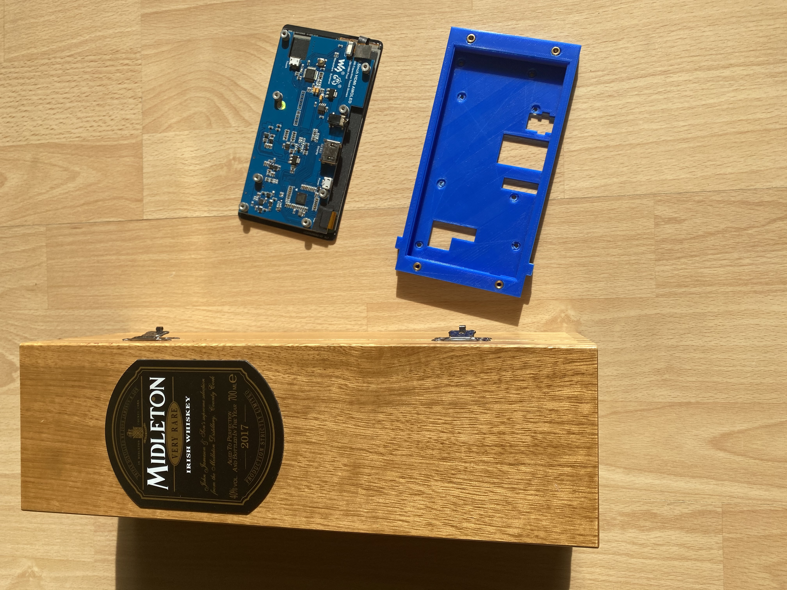
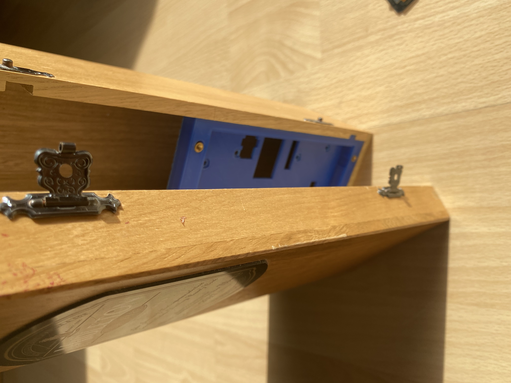
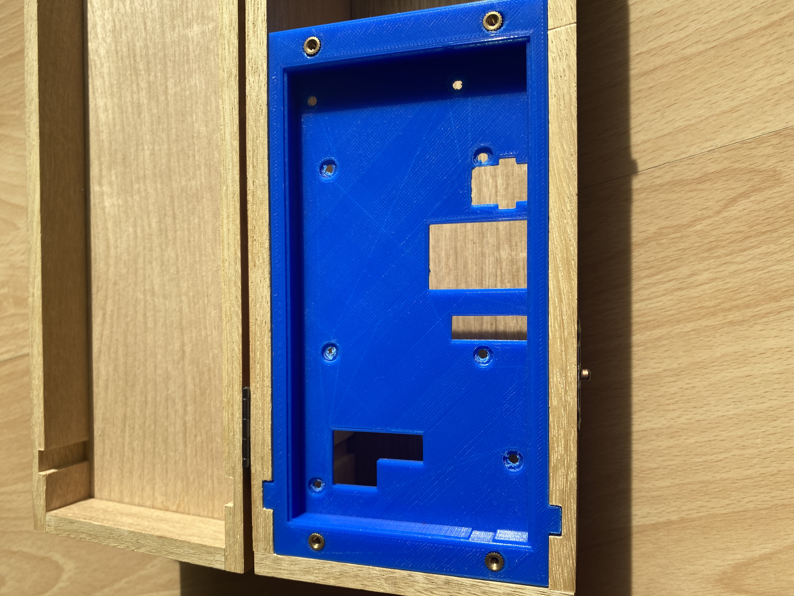
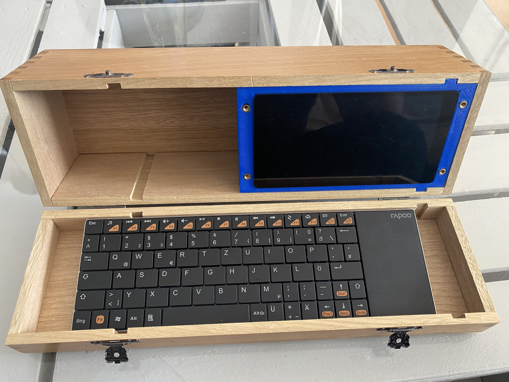

# waveshareoled
a 3d printable housing for the waveshare 5.5 inch hdmi amoled display with capacitive touch.

## initial print and test
In this first print the casing is just a half milimeter too tight for the display to fit in. It might make sense to add some fitting helpers and to make the casing a bit more roomy to avoid problems with tolerances and as it's supposed to get a faceplate anyhow.
The brass inserts are for mounting a wooden faceplate.

The presentation box is a nice wooden box from a Midleton irish whiskey. 

The display is a waveshare OLED display.

The brass insets are heat inserted with a soledring iron.

the keyboard is for now just layed in and needs its own printed fitting.